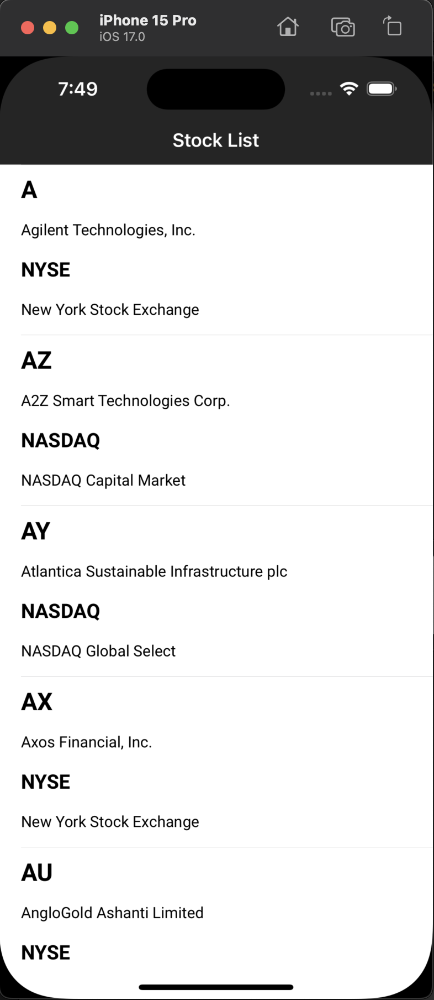
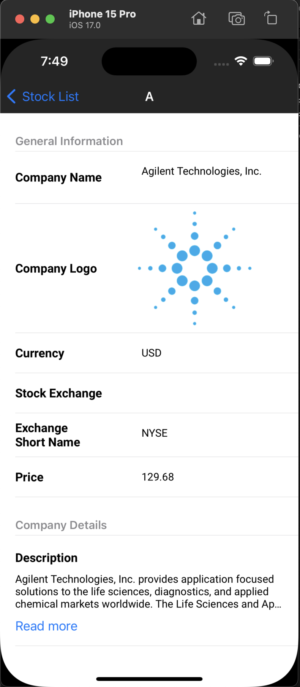
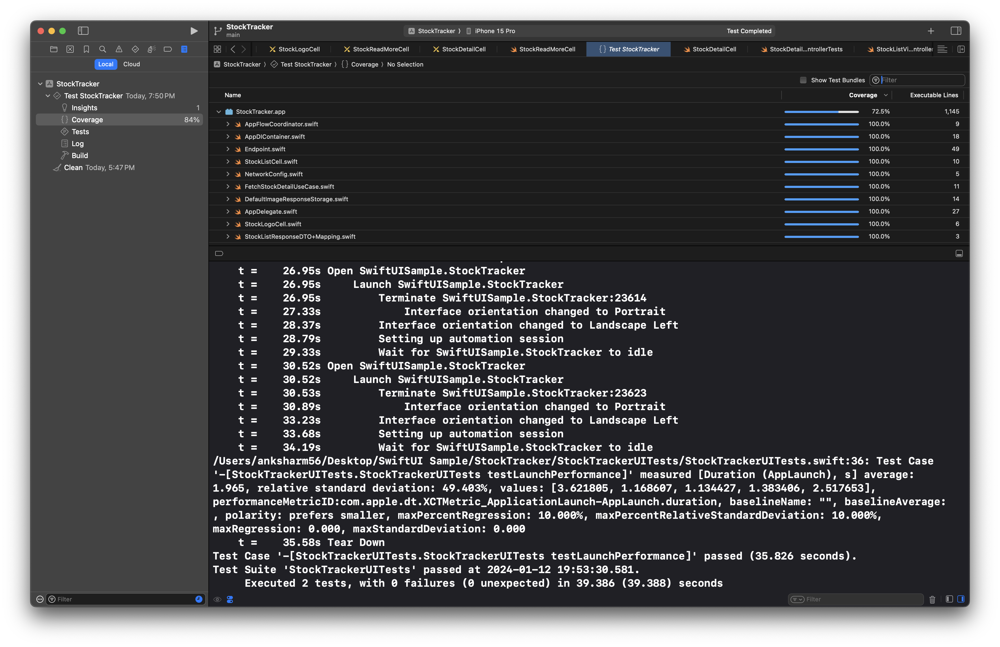

# StockTracker

## API Details

This App is using public stock apis. Find the api details by following link:

Website: https://site.financialmodelingprep.com/developer/docs

## Features
- **Stock List**: Showing US based stocks in list screen.
- **Stock Detail**: Showing details of the selected Stock e.g. symbol, logo, companyName, currency, price etc.

## Technologies Used
- Clean Architecture with MVVM, DI and Coordinator pattern
- Scalable Apis 
- Unit Test cases (84% Code-Coverage)
- Modular code.

## App Screenshots

| Stock List                                |
| -------------------------------------- |
|  |

| Stock Detail                                | Stock Detail                                |
| -------------------------------------- | ------------------------------------------- |
|  |  |

## Code Coverage Screenshot

| Code Coverage                                |
| -------------------------------------- |
|  |
