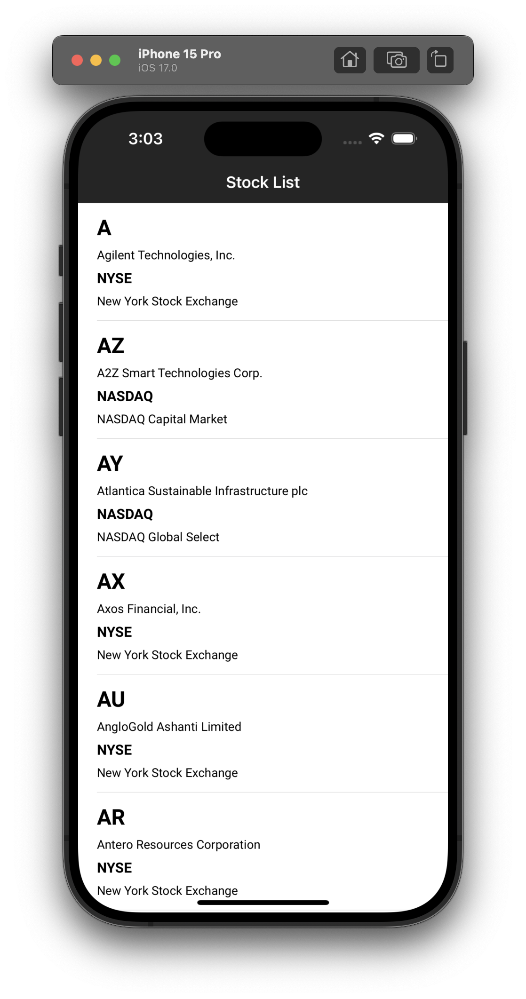
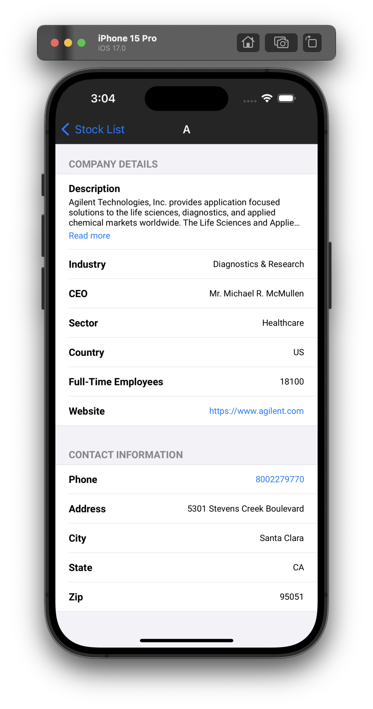
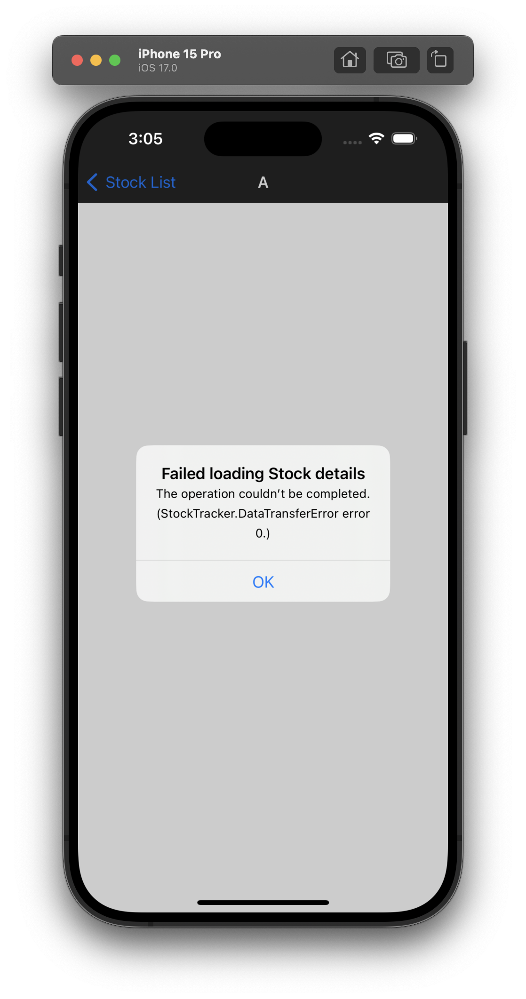

# StockTracker App

## API Details

This App is using public stock apis. Find the api details by following link:

Website: https://site.financialmodelingprep.com/developer/docs

## Screens
- **Stock List**: Showing US based stocks in list screen.
- **Stock Detail**: Showing details of the selected Stock e.g. symbol, logo, companyName, currency, price etc.

## Key features
- Clean Architecture with MVVM, DI and Coordinator pattern
- SwiftUI + Combine
- Unit Test cases (86% Code-Coverage)
- Designed for scalability 
- Modular code

## App Screenshots

<strong>Stock List Screen</strong>

  
  

<strong>Stock Detail Screen</strong>

  
  
  

<strong>Loading Screen and Error Popup</strong>

  
  

## Code Coverage Screenshot

| Code Coverage                                |
| -------------------------------------- |
|  |
