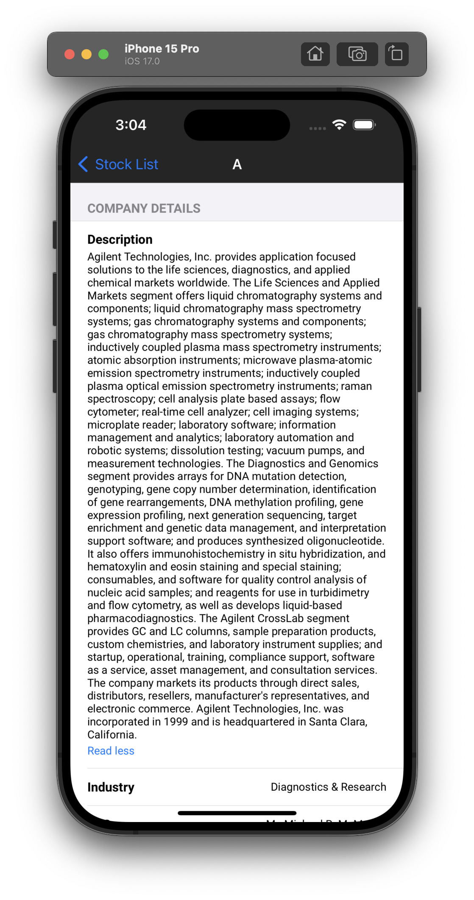

  

# StockTracker App

## Overview
The Stock Tracker app provides a user-friendly interface to explore and track US-based stocks. It offers essential features for both browsing a list of available stocks and delving into detailed information about each selected stock.

**Stock List**
- View a comprehensive list of US-based stocks.
- Quickly glance at essential details such as stock symbol, company logo, company name, currency, and current stock price.

**Stock Detail** 
- Access in-depth information about a specific stock.
- Explore details like stock symbol, company logo, company name, currency, and real-time stock price.

## Key Features
- Clean Architecture with MVVM, DI and Coordinator pattern
- SwiftUI + Combine
- Unit Test cases (86% Code-Coverage)
- Designed for scalability 
- Modular code

## API Details

This App is using public stock apis. Find the api details by following link:

Website: https://site.financialmodelingprep.com/developer/docs

## App Screenshots

<strong>App Icon & Launch Screen</strong>

  
  

<strong>Stock List Screen</strong>

  
  

<strong>Stock Detail Screen</strong>

  
  
  

<strong>Loading Screen & Error Popup</strong>

  
  

<strong>Content Unavailable Screen & Image failed Screen</strong>

  
  

## Code Coverage Screenshot

| Code Coverage                                |
| -------------------------------------- |
|  |
